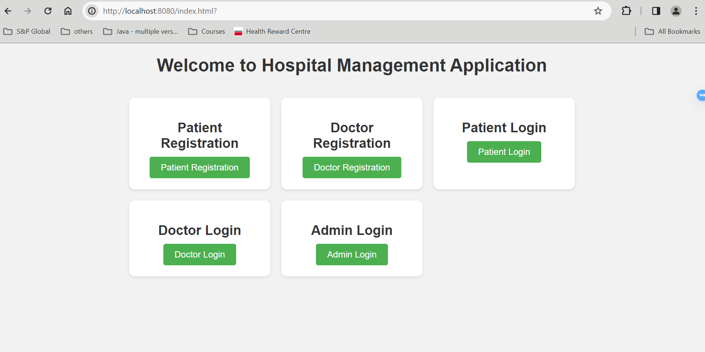

# Hospital Management Application

Welcome to the Hospital Management Application project!

## Description

This project is a web-based application developed using Spring Boot for managing hospital operations such as patient registration, doctor management, appointment scheduling, and more.

## Usage

To use the application, follow these steps:

1. Clone the repository to your local machine.
2. Ensure you have Java 17 and Maven installed.
3. Navigate to the project directory.
4. Run the following command to update dependencies and build the application:
    ```shell
    mvn clean install -U
    ```
5. Open your web browser and visit [http://localhost:8080](http://localhost:8080) to access the application.

## Technologies Used

- Java
- Spring Boot
- Hibernate
- Maven
- H2 Database (In-memory)
- HTML (frontend)

---

